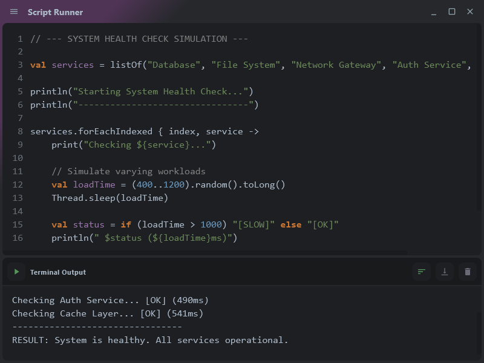
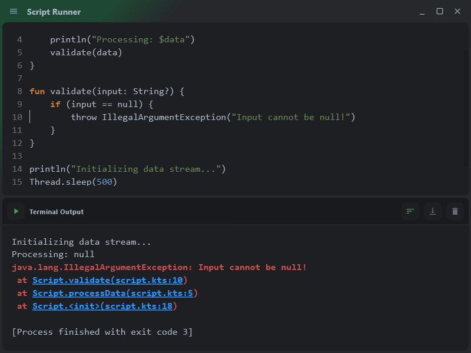
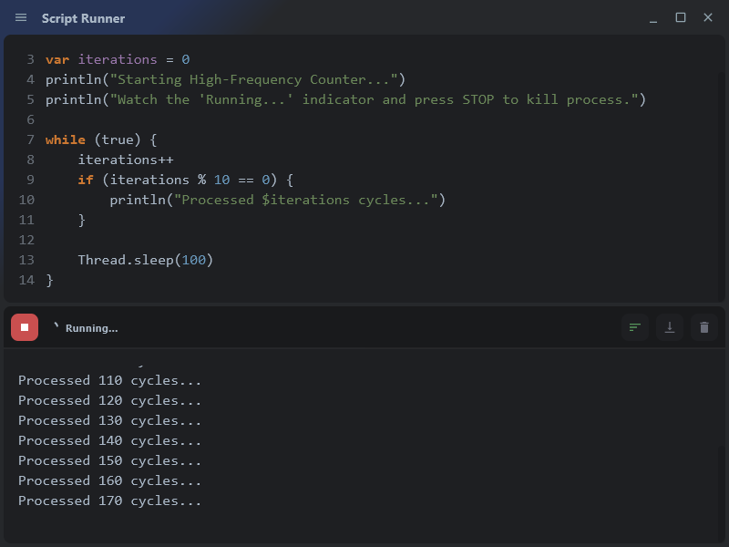
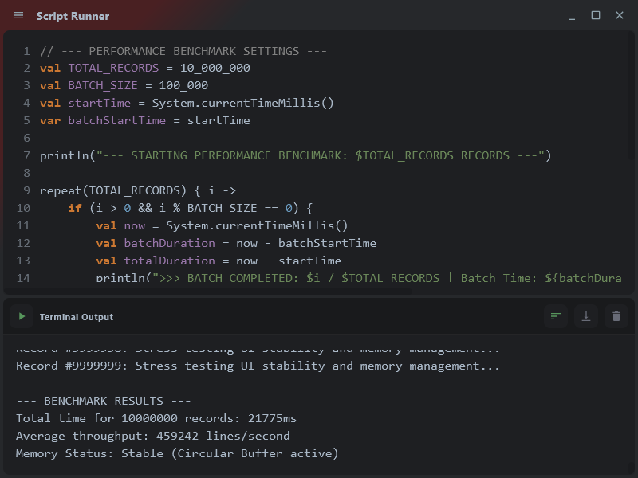

# Kotlin Script Runner

This is a Kotlin Multiplatform project targeting Desktop (JVM). It provides a lightweight, modern execution environment for running, debugging, and managing Kotlin scripts (`.kts`) with a custom graphical interface.

## Features

* **Dual-Pane Interface**: A resizable split-screen layout featuring a code editor and a live output terminal side-by-side.
* **Standard Execution**: seamless integration with the system's `kotlinc` compiler to execute scripts in a real environment.
* **Live Output Streaming**: Captures `stdout` and `stderr` in real-time, allowing for immediate feedback on long-running processes.
* **Process Management**:
  * Visual status indicators for running processes.
  * One-click termination for hanging or long-running scripts.
  * Clear reporting of process exit codes upon completion.
  * Recursive Process Cleanup: Recursively terminates all spawned compilers and scripts on exit, preventing background resource leaks.
* **Syntax Highlighting**: Custom highlighting for Kotlin keywords to improve code readability.
* **Smart Error Navigation**: Automatically parses execution errors and generates clickable links. Clicking a link instantly moves the editor cursor to the exact line and column of the issue.
* **Modern UI**: A dark-themed, frameless window design for a unified aesthetic.

## Performance & Scalability
The terminal engine is optimized for high-throughput logging:
* **Linear Complexity:** Achieved $O(n)$ scaling for log processing.
* **Throughput:** Capable of processing over **400,000 lines per second**.

## Screenshots

**Live Output**


**Clickable Error Navigation**


**Process Control**


**Performance Insight**


## Demo Video
You can find a video demonstration of the tool's features [here](./assets/) or [Watch on YouTube](https://www.youtube.com/watch?v=FmMFijfwSSQ)

## Prerequisites

* **JDK 11 or higher**: Required to run the JVM application.
* **Kotlin Compiler (`kotlinc`)**: Must be installed and available in the system PATH to enable script execution.

## Build and Run Desktop (JVM) Application

To build and run the development version of the desktop app, use the run configuration from the run widget
in your IDE’s toolbar or run it directly from the terminal:

- on macOS/Linux
  ```shell
  ./gradlew :composeApp:run
- on Windows
  .\gradlew.bat :composeApp:run
